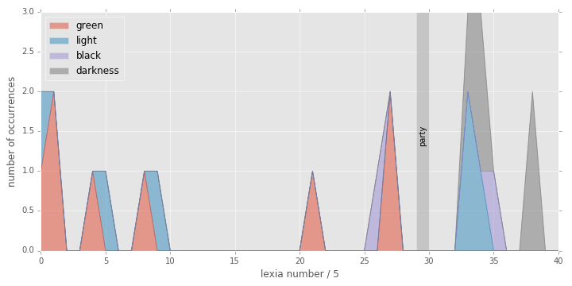

#Computational Text Analysis and Visualization

#Bio

 * Jonathan Reeve, grad student, Department of English and Comparative Literature
 * Specializing in computational literary analysis
 * Member, Group for Experimental Methods in the Humanities
 * Meets every Friday, 2-5pm, Studio@Butler 

#Examples

---

Stanford Literary Lab

---

Andrew J. Beveridge and Jie Shan

---

Matt Daniels

---

Andreas Mueller

---

---

---

Stanford Literary Lab 

---

#Let’s do it ourselves!

You’ll need these software ingredients: 

 * Python 3
 * NLTK for Python 3
 * Pandas for Python 3
 * Wordcloud for Python 3

--- 

Ways to use that software: 

 * On your computer (recommended)
 * On DHBox.org (temporary)
 * Using a cloud computing service (nitrous.io)

---

Links: 

 * The Jupyter notebook we’ll be using: http://bit.ly/dh-dataviz 
 * DHBox: http://dhbox.org (U: dataviz-workshop PW: dataviz-2016)
 * Another DHBox server: http://bit.ly/dataviz-dhbox (same credentials)
	
---

Learn more: 

 * The free online NLTK book: http://nltk.org/book
 * Book: Python 3 Text Processing with NLTK 3 Cookbook
 * Stop by the Open Lab, every Friday from 2-5pm, Studio@Butler

