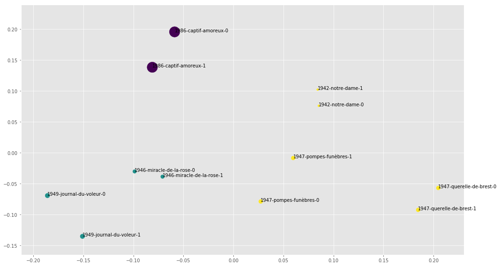

# Does "late style" exist?

---

Jonathan Reeve  
Literary Modeling and Visualization Lab  
Group for Experimental Methods in the Humanities  
Columbia University  

# The Problems / Hypotheses

## Edward Said: _On Late Style_

{width=35%}

## Characteristics

> "The maturity of the late works of significant artists does not resemble the kind one finds in fruit. They are, for the most part, not round, but furrowed, even ravaged. Devoid of sweetness, bitter and spiny, they do not surrender themselves to mere delectation." (Adorno, quoted in Said)
 - Beethoven's Ninth Symphony

## An Old Critical Concern

 - Shakespeare studies of the 18th C
 - Lipking, _The Life of the Poet_ (1984)
 - Adorno on Beethoven
 - Recently: "stylochronometry" papers
 
# Difficulties / Caveats

## Ambiguities of "late"

 - Untimely? Ahead/behind one's time? 
 - Dead? "The late Mr. Darcy"
 - Running late

## Ambiguities of "style"

 - Contradictory definitions of "late style"

>Said: “[late style] has the power to render disenchantment and pleasure without resolving the contradiction between them. What hold them in tension, as equal forces straining in opposite directions, is the artist's mature subjectivity, stripped of hubris and pomposity, unashamed either of its fallibility or of the modest assurance it has gained as a result of age and exile"

 - Style as content? 

## Potential causes 

 - Proximity to death? 
 - Foreknowledge of one's death? 
 - Old age? (_Alterstil_ v. _Spätstil_)
 - Old critics? (Said)

# Operationalizing

## Stylometry

 - Quantifies textual stylistic differences
 - Well-studied in authorship attribution

## Document Embeddings

 - Averaged word embeddings
 - Encode semantic information about documents
 - Test "style as content" hypothesis
 
# Corpus Creation

## Corpus A

 - Hand-curated (sometimes with OCR)
 - Writers discussed by Said: Mann, Proust, Genet 
 - Writers with well-known "late periods": James, Dickens
 - All electronically-available texts of each (virtually all texts)

## Corpus B

 - Machine-generated using [Corpus-DB.org](http://corpus-db.org)
 - All Project Gutenberg works in English, 
   - with the "PR" Library of Congress category (British Lit.)
   - by authors with more than 8 works 
 - 141 writers
   - Pruned according to available publication metadata to 51 writers
   - ~900 total works
 
# Method

## Pre-processing

 - Documents vectorized to document-term matrices with 800 MFW
 - Pre-clustered according to: 
   - Date
   - Years to Death
 - Documents randomly sampled to make same length
 
## Dimensionality Reduction

 - TF matrices reduced to 5 dimensions
   - using Principal Component Analysis (PCA)
   - 5 Dimensions perform better than 2
     - (acc. to previous grid search study)
   - Plots are projections of first 2

## Clustering

 - Periods modeled using a Bayesian Gaussian Mixture model
   - 1-3 possible "periods" or clusters
   - Clustering happens in 5D
 - 20 trials, averaged

## Evaluation

 - "Lateness" 
   - Of a work: L2 norm of the 5D document vector
   - Of a writer: 
     - Difference of Euclidean L2 norms of centroids of doc. vectors 
       - PCA-reduced MFW vectors
       - or semantic document embedding vectors
     - as pre-clustered by date or years to death to 1-3 clusters
 - "Periodicity"
   - Adjusted Rand Index comparing BGM clusters with initial date-based 1D-clustering
     - Category-agnostic mutual information score
     
# Results

## Corpus A

## Marcel Proust

## Thomas Mann

## Mary Augusta Ward

## Henry James

## Charles Dickens

## Willa Cather

## Periodicities

| Author    | Periodicity Score |
|-----------|-------------------|
| James     |             0.472 | 
| Dickens   |             0.469 |
| Genet     |             0.457 |
| Mann      |             0.367 |
| Conrad    |             0.177 |
| Cather    |             0.177 |
| Ward      |             0.166 |
| Proust    |             0.023 |

# Results: Corpus B

---

## Mean Lateness, All

-0.0171  
(Early style, not late style.)  

## Mean Periodicities

## Mean Latenesses (TTD)

## Doc Embeddings: Mean Latenesses

## Doc Embeddings: Mean Periodicities

## Doc Embeddings: Overall Mean

Mean: -0.0288  
(Even stronger early style.)  

# Conclusions

---

 - ~~Late Style~~ Early Style
   - Even stronger when style=content
   - Late style is weakly present when calculated with TDD
     - Needs more study

---

## Future Plans

 - Bigger corpora
 - Better stylometry (cosine delta?)
 - Better statistics (confidence intervals, hypothesis testing)
 - More precise engagement with criticism

## Contributing

 - Completely free and open-source
 - Help needed
 - Funding? 
 
## Links

 - [jonreeve.com](jonreeve.com): my website
 - [xpmethod.plaintext.in](http://xpmethod.plaintext.in/): our lab
 - [jonreeve.com/presentations/dh2018](http://jonreeve.com/presentations/dh2018): this presentation
 - [github.com/JonathanReeve/late-style-PCA](https://github.com/JonathanReeve/late-style-PCA): the code, bibliography
 - [twitter.com/j0_0n](http://twitter.com/j0_0n): my twitter account
