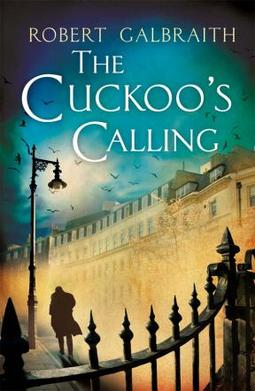

# What is computational literary analysis? 

---

Jonathan Reeve  
Literary Modeling and Visualization Lab  
Group for Experimental Methods in the Humanities  
Columbia University  

# The Basics

## Reading Books With Computers

## "Distant Reading" 

## The Great Unread

# Famous Examples

## Authorship Attribution

## Hamlet Network Analysis

Stanford Literary Lab

## Rap Lyrics Vocabulary Analysis

Matt Daniels

## Word Cloud

Andreas Mueller

## "Loudness" Analysis

Stanford Literary Lab 

## Game of Thrones Characters

# Stylometry

--- 

---

---

---

# Other Examples

## Allusion Detection 

## Color Words in _Paradise Lost_

## Dependency Parsing

---

## Word Embeddings

## Document Vectors

## Ulysses: Titles of Works

## Language Generation

*Socrates*: Do you came down, attain immortality as we must first make the longest ears—No, Phaedrus, then pray to agree and writing speeches.

*Phaedrus*: Certainly. Yes, certainly. What he must speak then I think he speaks is being guided about, which you mean?

*Socrates*: Do you seem less sense about rhetoric.

*Phaedrus*: True. What?

# Macro-Etymological Textual Analysis

---

Consider these near-synonyms: 

 - ask / question / interrogate
 - kingly / royal / regal

---

---

---

# Chapter Analysis

## Words distinctive of first paragraphs of chapters

morning, early, breakfast, afternoon, summer, autumn, winter, sunday, weather, october, arrival, june, september, saturday, awoke, situated, november, july, season, december

## Words distinctive of middle paragraphs of chapters

replied, retorted, inquired, doesn't, haven't, mustn't, shouldn't, wid, fer, wi, em, yer, protested, nothin

## Words distinctive of last paragraphs of chapters

kissed, farewell, bye, muttered, parted, disappeared, sank, page, asleep, strode, chapter, kiss, withdrew, homeward, sobbing, thanked, wept, murmured, prayed

## Chapter Stats

# Which are higher-rated on Goodreads? 

---

Novels set in Paris, or London?

<li class="fragment">London: 3.35</li>
<li class="fragment">Paris: 3.8</li>

# Most-Mentioned Greco-Roman Mythological Figure

---

 - Venus: 229
 - Muses: 156
 - Apollo: 136
 - Jupiter: 126
 - Juno: 100
 - Pan: 94
