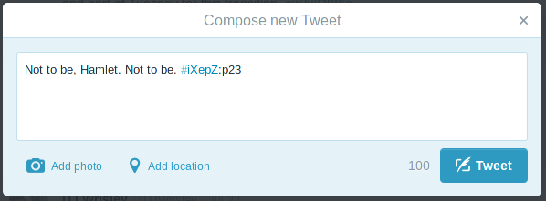

%Annotags: a Decentralized Textual Annotation Protocol
%Jonathan Reeve
%24 July 2015

#Conversations in the Margins

#Problems

 * How can we tweet about specific parts of a book? 
 * `#HarryPotterAndTheSorcerer'sStonePage23Paragraph11` isn't practical. 
 * How can we write in the margins of ebooks? 
 * How can we have conversations in the margins? 
 
#Centralized Solutions

 * CommentPress, Socialbook, Annotation Studio, Ebrary
 * Annotations live on the central server. 
 * The size of the virtual margins are limited by the structure of the web page.  

#Annotags: a Decentralized Solution 

 * Not a product, platform, or service. 
 * A protocol for encoding text metadata into a hashtag. 
 * These hashtags can be posted to Twitter, Facebook, private blogs. 
 * Annotags can even be written on paper and sent in the mail.  

#Example

#Anatomy of an Annotag

##`#iXeBz:p23`

 * First letter connotes the type of bibliographic identifier (ISBN, OCLC, short DOI). 
 * Following letters contain the identifier, encoded in base-62 for brevity.  
 * Suffix contains a human-readable text location. Here, page 23. 

#How Can I Make One?

 * [Annotag Calculator Web App](http://jonreeve.com/projects/annotags/) 
 * [Annotag Bookmarklet](http://jonreeve.com/2015/04/a-bookmarklet-for-creating-annotags/) 
 * Write your own.   

#Links

 * Annotag Calculator: [jonreeve.com/projects/annotags/](http://jonreeve.com/projects/annotags/)
 * These slides: [jonreeve.com/presentations/keydh15](http://jonreeve.com/presentations/keydh15)
 * My email address: <jon.reeve@gmail.com>
