# Computational Approaches to the Study of Literary Style 

----------------------------

Jonathan Reeve  
Literary Modeling and Visualization Lab  
Group for Experimental Methods in the Humanities  
Columbia University  

----------------------------

## Open source philosophy

 - always-already online
 - open-access
 - collaborative

----------------------------

# Macro-Etymological Text Analysis

-----------------

Consider these near-synonyms: 

 - ask / question / interrogate
 - kingly / royal / regal

-----------------

-----------------

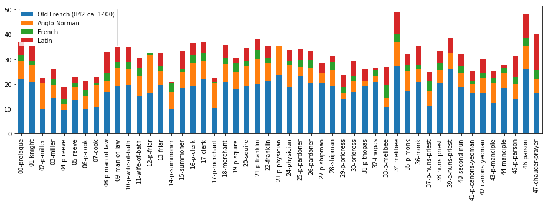

-----------------

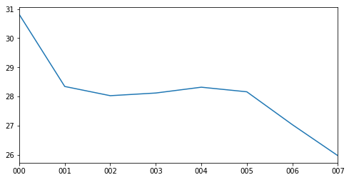

----------------------------

----------------------------

----------------------------

----------------------------

# Character Voice

## Stylistic Analysis

----------------------------

----------------------------

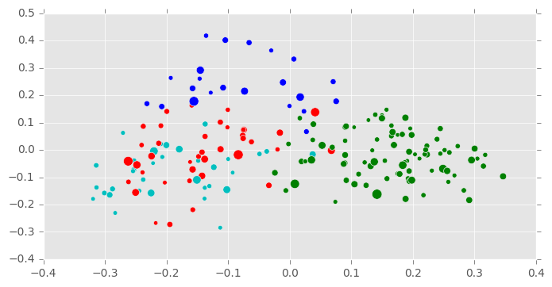

----------------------------

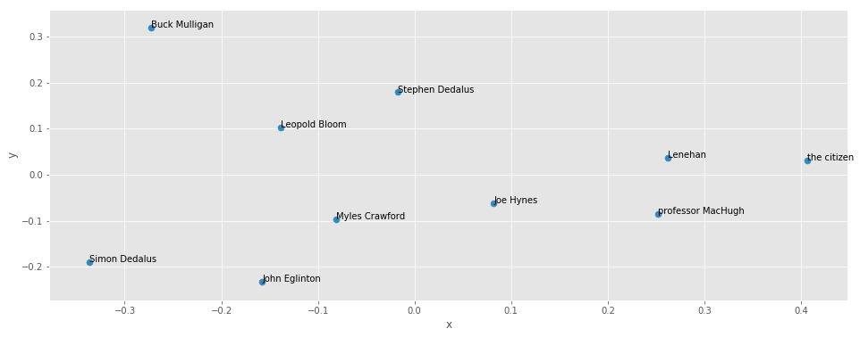

----------------------------

## Semantic Analysis

----------------------------

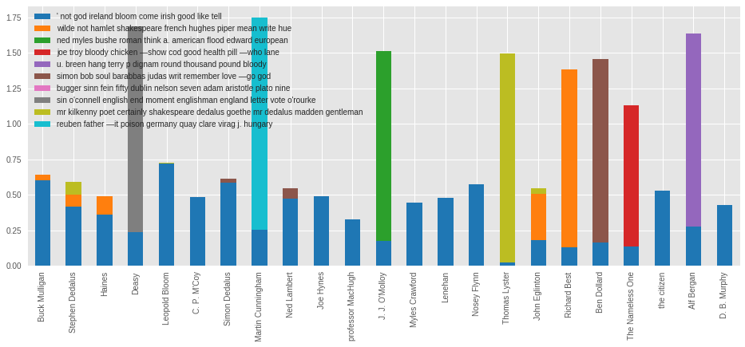

----------------------------

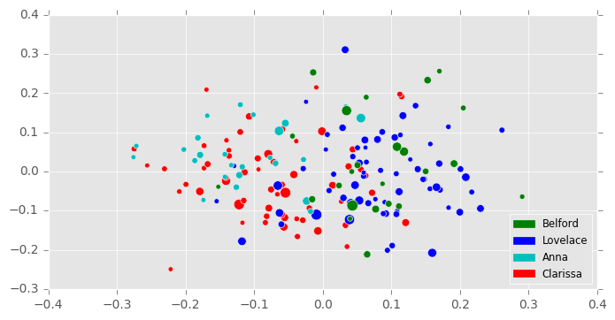

----------------------------

----------------------------

# Histories of Literary Criticism

----------------------------

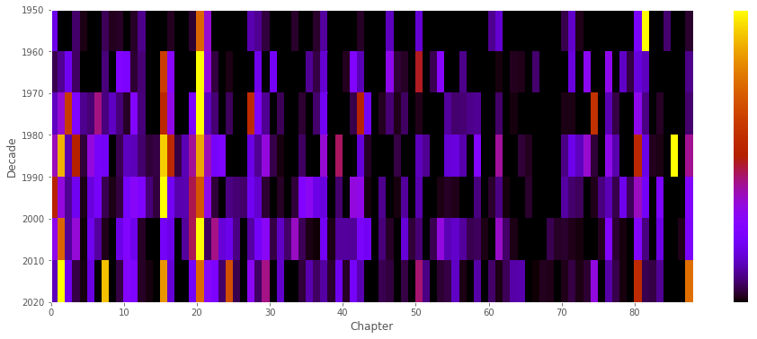

----------------------------

## Words Likely to Appear in Critical Citations, 20th C

life, light, world, woman, new, great, consciousness, live, eye, knowledge, long

## Words Likely to Appear in Critical Citations, 19th C

life, Paris, old, live, time, sit, key, soul, prayer, consciousness, belief, marriage

----------------------------

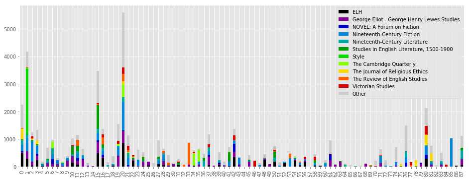

----------------------------

# Experiments in Procedural Corpus Creation

## Problems

 - Difficult to download and manipulate large collections of text files
 - Book metadata is scattered

## Solution

 - Aggregate texts from public-domain sources
 - Clean licenses, paratext
 - Aggregate metadata from Wikipedia, Goodreads, Etc. 

----------------------------

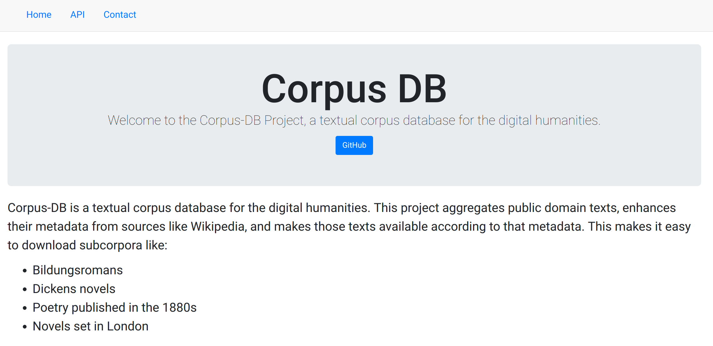

----------------------------

----------------------------

## Which are higher-rated on Goodreads? 
Novels set in Paris, or London?

<li class="fragment">London: 3.35</li>
<li class="fragment">Paris: 3.8</li>

## Which Austen and Eliot novels are stylistically similar? 

----------------------------

----------------------------

# Chapters

----------------------------

 - Uses Chapterize
 - Uses corpus-db.org

----------------------------

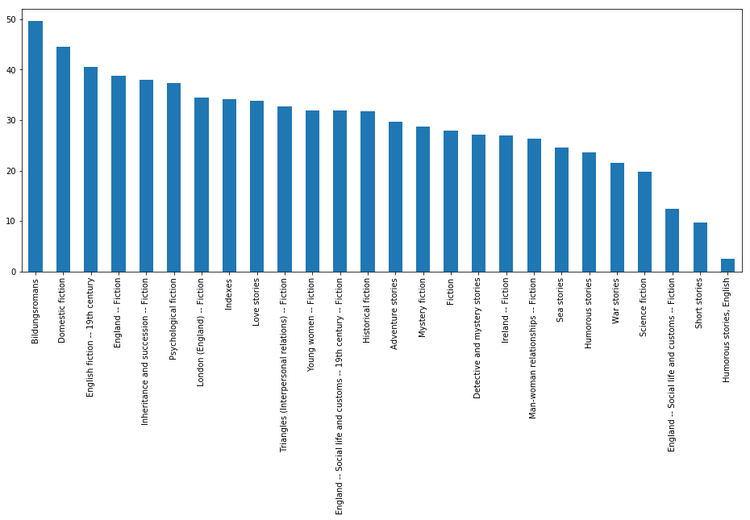

----------------------------

----------------------------

## Words distinctive of first paragraphs of chapters

morning, early, breakfast, afternoon, summer, autumn, winter, sunday, weather, october, arrival, june, september, saturday, awoke, situated, november, july, season, december

## Words distinctive of middle paragraphs of chapters

replied, retorted, inquired, doesn't, haven't, mustn't, shouldn't, wid, fer, wi, em, yer, protested, nothin

## Words distinctive of last paragraphs of chapters

kissed, farewell, bye, muttered, parted, disappeared, sank, page, asleep, strode, chapter, kiss, withdrew, homeward, sobbing, thanked, wept, murmured, prayed

----------------------------

# Allusion Detection

## Allusion Detection

 - Uses custom fuzzy text-matcher (plagiarism detector) over 500 novels
 - "Biblical": quote/structural resonance from the KJV
 - "Classical": mention of Greek/Roman diety
 
----------------------------

----------------------------

----------------------------

## Most-Quoted Book of the Bible

----------------------------

 - Matthew: 129
 - Luke: 83
 - Psalms: 70
 - Job: 50
 - Isaiah: 48
 - Mark: 46
 - Proverbs: 39
 - Genesis: 34

----------------------------

## Most-Mentioned Greco-Roman Mythological Figure

----------------------------

 - Venus: 229
 - Muses: 156
 - Apollo: 136
 - Jupiter: 126
 - Juno: 100
 - Pan: 94

----------------------------

# Resources

## Do it yourself

## Books

 - [nltk.org/book](http://nltk.org/book)
 
## Notebooks

 - [github.com/JonathanReeve/dataviz-workshop-2017]( https://github.com/JonathanReeve/dataviz-workshop-2017/blob/master/dataviz-workshop.ipynb) 
 - [github.com/JonathanReeve/advanced-text-analysis-workshop-2017](https://github.com/JonathanReeve/advanced-text-analysis-workshop-2017) 
 
## DHBox

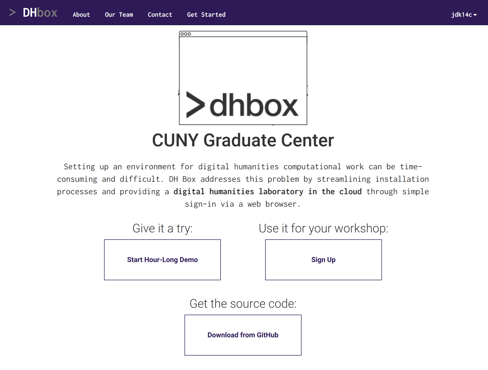

## DHBox Notebooks

 - [github.com/DH-Box/docs/](https://github.com/DH-Box/docs/blob/master/text-analysis-tutorial.md)

## DH-USB

----------------------------

----------------------------

# Links

## Links

 - [xpmethod.plaintext.in](http://xpmethod.plaintext.in/): our lab
 - [jonreeve.com](jonreeve.com): my website
 - [jonreeve.com/presentations/montclair](http://jonreeve.com/presentations/montclair): this presentation
 - [github.com/JonathanReeve](https://github.com/JonathanReeve): the code
 - [twitter.com/j0_0n](http://twitter.com/j0_0n): my twitter account

----------------------------
