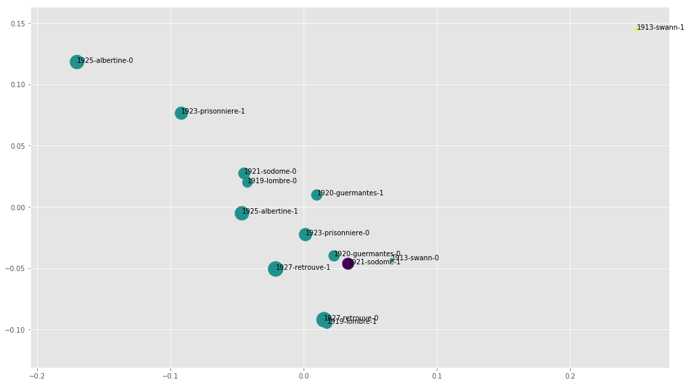
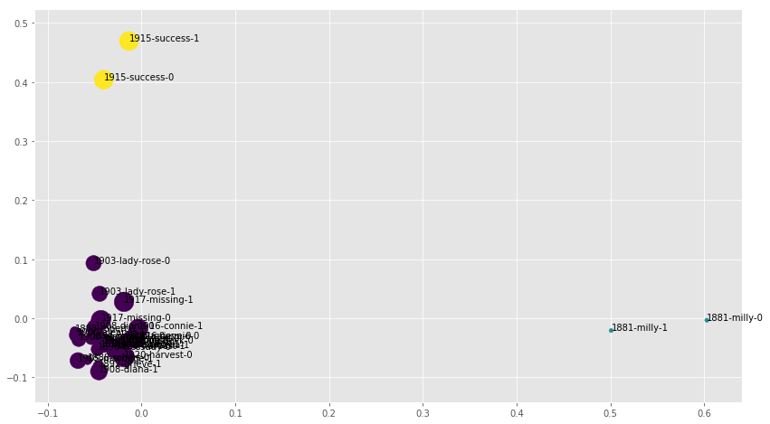
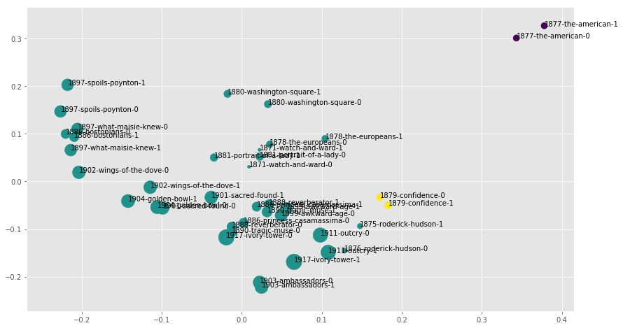
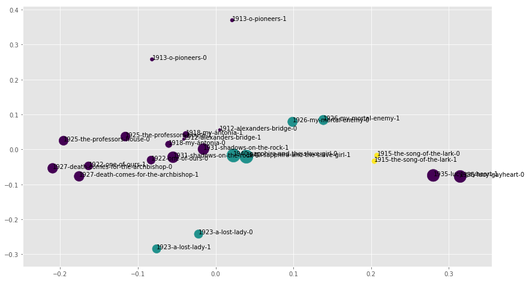
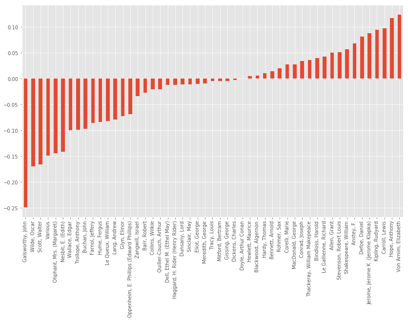
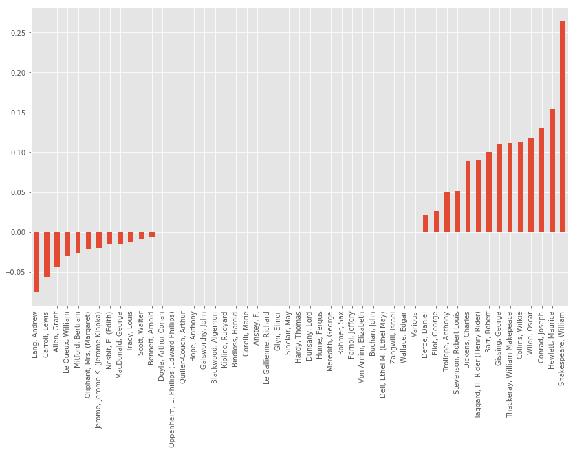

# Does "late style" exist?

---

Jonathan Reeve  
Literary Modeling and Visualization Lab  
Group for Experimental Methods in the Humanities  
Columbia University  

# The Problems / Hypotheses

## Edward Said: _On Late Style_

{width=35%}

## Characteristics

> "The maturity of the late works of significant artists does not resemble the kind one finds in fruit. They are, for the most part, not round, but furrowed, even ravaged. Devoid of sweetness, bitter and spiny, they do not surrender themselves to mere delectation." (Adorno, quoted in Said)
 - Beethoven's Ninth Symphony

# Operationalizing

## Stylometry

 - Quantifies textual stylistic differences
 - Well-studied in authorship attribution

## Document Embeddings

 - Averaged word embeddings
 - Encode semantic information about documents
 - Test "style as content" hypothesis
 
# Corpus Creation

## Corpus-DB

 - Machine-generated using [Corpus-DB.org](http://corpus-db.org)
 - 51 writers
   - ~900 total works

## Query

```sql
SELECT text FROM gutenberg 
WHERE count(text) > 8 
AND lang = 'en' AND genre = 'fiction'
```

# Method

## Stylometry++

 - Random sampling of documents
 - Document-term matrices of 800 MFW
 - Reduced to 5D using PCA
 - Modeled using Bayesian Gaussian Mixture model
   - 1-3 possible "periods" or clusters
 - 20 trials, averaged
 - ~12 hour laptop computation

## Metrics

 - "Lateness" 
   - Of a work: L2 norm of the 5D document vector
   - Of a writer: 
     - Difference of Euclidean L2 norms of centroids of doc. vectors 
 - "Periodicity"
   - Adjusted Rand Index comparing BGM clusters with initial date-based 1D-clustering
     - Category-agnostic mutual information score
     
# Results

## Marcel Proust



## Mary Augusta Ward



## Henry James



## Charles Dickens


## Willa Cather



## Periodicities

| Author    | Periodicity Score |
|-----------|-------------------|
| James     |             0.472 | 
| Dickens   |             0.469 |
| Genet     |             0.457 |
| Mann      |             0.367 |
| Conrad    |             0.177 |
| Cather    |             0.177 |
| Ward      |             0.166 |
| Proust    |             0.023 |

---


## Mean Lateness, All

-0.0171  
(Early style, not late style.)  

## Mean Periodicities



## Mean Latenesses (TTD)



## Doc Embeddings: Mean Latenesses


## Doc Embeddings: Mean Periodicities


## Doc Embeddings: Overall Mean

Mean: -0.0288  
(Even stronger early style.)

# Conclusions

---

 - ~~Late Style~~ Early Style
   - Even stronger when style=content

---

## Links

 - [jonreeve.com](jonreeve.com): my website
 - [xpmethod.plaintext.in](http://xpmethod.plaintext.in/): our lab
 - [jonreeve.com/presentations/nycdhweek2019](http://jonreeve.com/presentations/nycdhweek2019): this presentation
 - [github.com/JonathanReeve/late-style-PCA](https://github.com/JonathanReeve/late-style-PCA): the code, bibliography
 - [twitter.com/j0_0n](http://twitter.com/j0_0n): my twitter account
