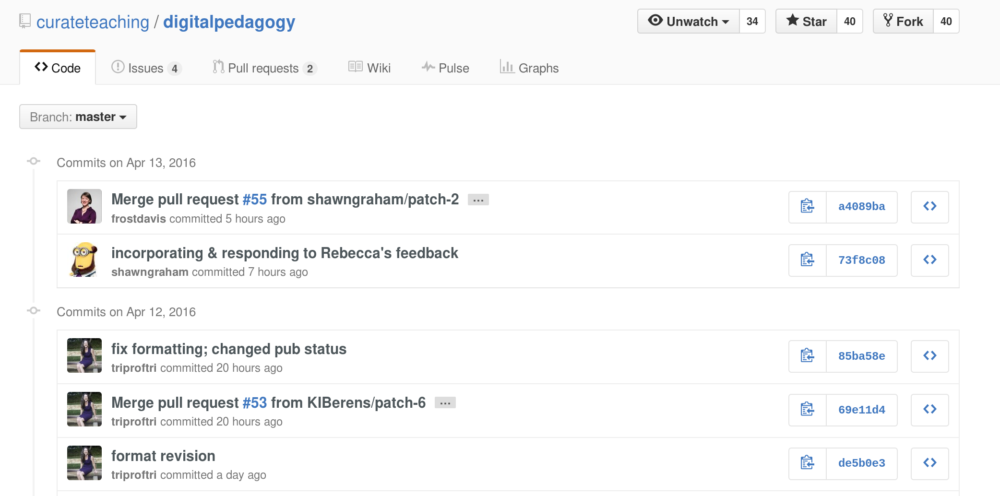
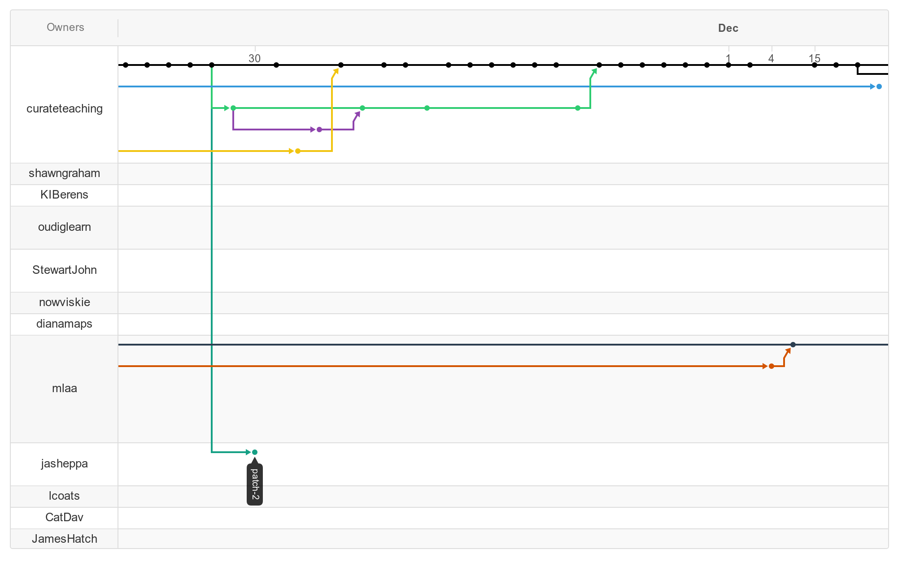
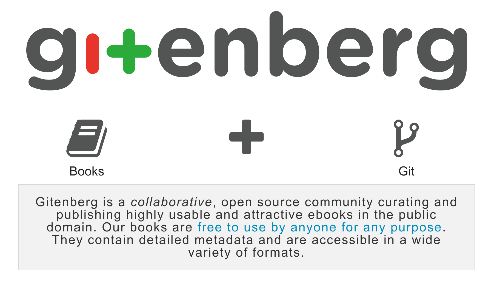

# {#overview .step data-scale=10}

# {.step data-x=-4000 data-y=2000 data-scale=8}

 

# Applications of Distributed Version Control Technology to the Creation of Digital Scholarly Editions {.step data-x=-2000 data-y=-1000 data-scale=7}

#{.step data-x=-2000 data-y=1200 data-scale=5} 

##Jonathan Reeve 

##Group for Experimental Methods in the Humanities

##Columbia University

# About {.step data-x=3500 data-y=-1000 data-scale=5}

# What is version control, and why should I care? {.step data-x=2000} 

As textual scholars, we care about: 

* textual difference 
* versions of texts
* collaborative editing
* semantic metadata

So do version control systems!
It’s a perfect match! 

# Problems with Electronic Texts {.step data-x=2000 data-y=1000} 

* Difficult to edit
* Editorial histories often obscure
* Stuck in the hands of the few

# Version control systems: {.step data-x=2000 data-y=2000} 

* Store every version of a document / project
* Store metadata about every edit: who made the change, when the change happened, what changed
* Facilitate collaboration, analysis, version management

# About version control systems: {.step data-x=2000 data-y=3000} 

* Git, mercurial, svn, bazaar
* Open-source, community-owned 
* Some centralized, some decentralized
* Used very widely by coders (over 10 million GitHub repositories) 
* Starting to be used by humanists

# Version Control is Useful {.step data-x=3000} 

* Writing papers 
* Collaborating
* Text collation 
* Analyzing differences between texts

# Features:  {.step data-x=3000 data-y=1000} 

* Temporarily reset your project to an earlier version: 

`git checkout <change number>`

* Revert a single change: 

`git revert <change number>`

* Combine changesets from two versions: 

`git merge <branch name>`

# Version Control is Efficient {.step data-x=4000} 

Fruit v1.0: apples, oranges, bananas
Fruit v1.1: apples, oranges, bananas, pineapples

#Ordinary filesystem: {.step data-x=4000 data-y=1000} 

* Fruit1.0.txt, fruit1.1.txt 
* Contains redundant copies of apples, oranges, bananas. 

# {.step data-x=4000 data-y=2000} 

{.figure}

#Version control system {.step data-x=4000 data-y=3000} 

Git database contains parts: 

- A: apples, oranges, bananas
- B: pineapples

Versions are compiled from these parts: 

- v1.0: part A
- v1.1: parts A+B

#Distributed Version Control {.step data-x=5000} 

{.figure}

# {.step data-x=5000 data-y=1000} 

* Doesn’t privilege a central text, repository, user, or computer
* Anyone can pull changes from anyone 
* Democratization of scholarly editing? 

# {.step data-x=5000 data-y=2000} 

#Version Control Cloud Services {.step data-x=5000 data-y=3000} 

* GitHub: a place for git repositories
* Also BitBucket, GitLab, etc. 
* Back up your project in the cloud
* Make it open-source, allowing others to contribute

#Collaboration Tools {.step data-x=5000 data-y=4000} 

* Forking
* Pull requests
* Comments on PRs, issues, lines

#Project Management {.step data-x=5000 data-y=5000} 

* Issues
* Wiki
* Milestones
* Analysis

#Examples {.step data-x=8000 data-y=-1000 data-scale=5}

#Digital Pedagogy in the Humanities {.step data-x=7000} 

# {.step data-x=7000 data-y=1000} 

# {.step data-x=7000 data-y=2000} 

# GITenberg {.step data-x=8000} 

# About GITenberg {.step data-x=8000 data-y=1000} 

* ~45,000 books
* Anyone can edit (“crowdsourced”)
* Gitenberg.org

# Git-Lit {.step data-x=9000} 

# About Git-Lit {.step data-x=9000 data-y=1000} 

* Open-source initiative to parse and post to GitHub 50,000 works from the British Library
* Parsing ALTO XML, generating Markdown
* Creating beautiful web-based reading editions for each
* Many will be first electronic publications
* Anyone can get involved! 

# Learn More {.step data-x=12000 data-y=-1000 data-scale=5} 

# To Get Started {.step data-x=11000} 

* Edit in the browser!
* Get a command line
* Learn basic commands
* Use plain text formats (Markdown, XML, LaTeX)
* Download git
* Get a GitHub username

#Further Resources {.step data-x=12000} 

* Try Git: <https://try.github.io>
* GitHub guides: account: <https://guides.github.com>
* This presentation: <http://jonreeve.com/presentations/sts2016/>
* My website: <http://jonreeve.com>
