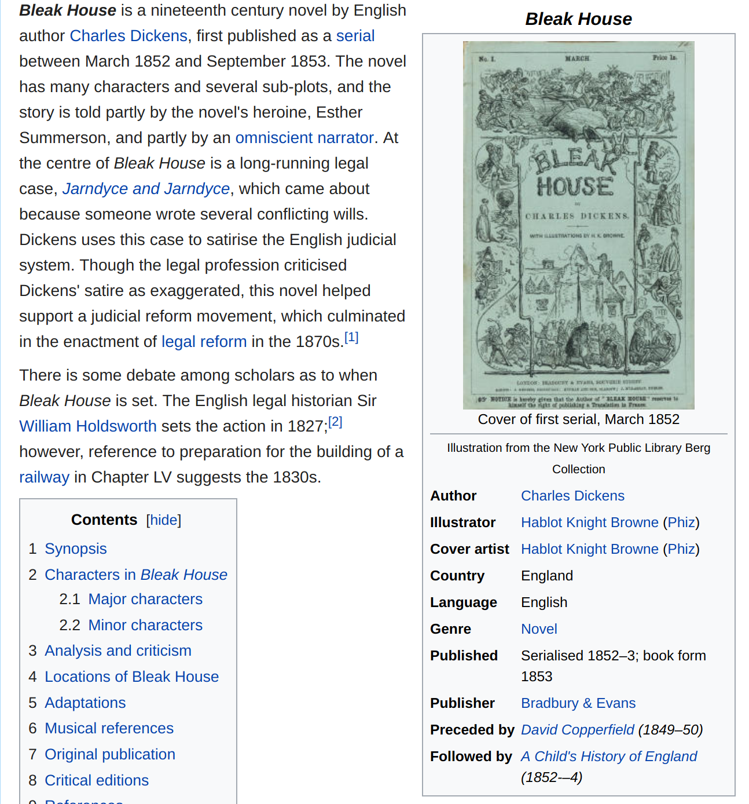
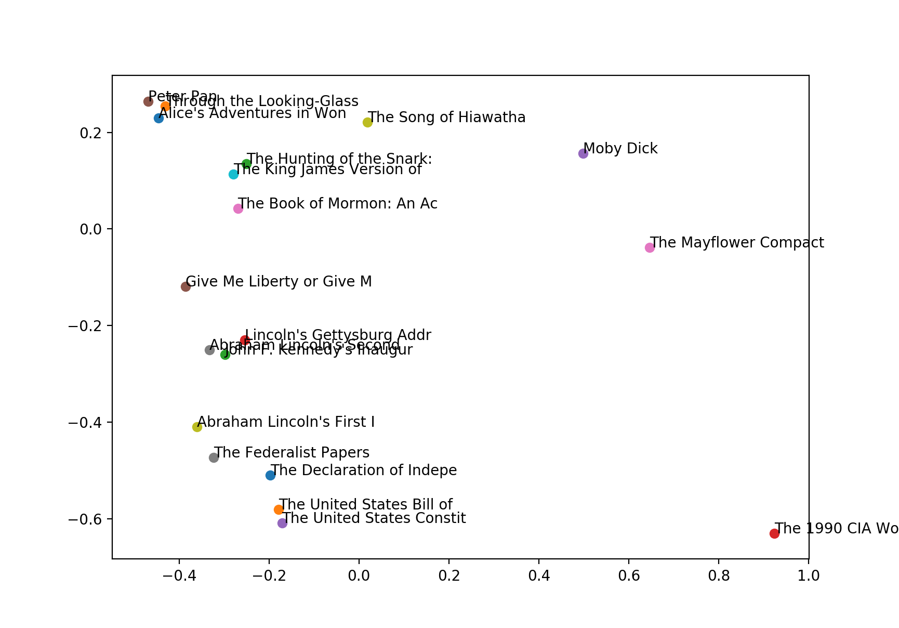

## Problem

How can I download all the Charles Dickens novels? 


---


---


---

# Poor Solution 


---

## Project Gutenberg Problems

 - Server bans robots
 - Many duplicate texts
 - Texts contain paratext, licenses

---

## Metadata Problems 

 - No publication dates
 - Little other metadata.
 
---

## Wikipedia Has Metadata

 - Novel setting (London, Paris)
 - Genre, category (Bildungsroman)

---


 
---


 
---

## Book Databases Have Metadata

 - Google Books
 - Amazon
 - Goodreads
 
---

## Solution


---

## Solution

Programmatically combine metadata from: 

   - Project Gutenberg
   - Wikipedia
   - Google Books
   - Amazon
   - Goodreads

---

## Solution: Clean Texts

  - Strip legal licenses
  - Strip paratexts (tables of contents, indices)

---

## Solution: Vector-Based Deduplication

 - Use word embeddings to identify possible duplicates
 - (Also finds texts that belong to the same series)

---

## Solution: Combine Archives

 - Project Gutenburg
 - Oxford Text Archive (Public Domain)
 - British Library (Public Domain)
 - UVA Etext Archive
 - Others
 
---

# Corpus-DB 

---

## Corpus-DB Is Not

 - Not a service
 - Not a website
 - Not user-friendly

---

## Corpus-DB

 - A textual corpus database
 - With awesome metadata
 - And an API wrapper for it

---

## DB Example: a Single-Author Corpus

```sql
SELECT fullText from corpusDB
WHERE author = "Charles Dickens"
```

---

## DB Example: Novels Set in London

```sql
SELECT * from corpusDB
WHERE genre = "Novel" 
AND setting = "London"
```
---

## DB Example: British Literature

```sql
SELECT * from corpusDB
WHERE LCC = "PR"
```

---

## DB Example: Novels Published in Britain Between 1900-1930

```sql
SELECT * from corpusDB
WHERE genre = "Novel" 
AND LCC = "PR"
AND pubYear BETWEEN 1900 AND 1930
```
---

## DB Example: Bildungsromane

```sql
SELECT * from corpusDB
WHERE genre = "Novel" 
AND wikipediaCategory LIKE "%Bildungsromans%"
```

---

## API

 - RESTful
 - Query over HTTP using mnemonic URLs
 - Returns JSON
 
---

## API Example: Single-Author Corpus

```
api.corpus-db.org/author/Dickens
```

---

## API Example: Setting 

```
api.corpus-db.org/setting/London
```

---

## API Example: Wikipedia Category

```
api.corpus-db.org/novels/adaptedTo/comics
api.corpus-db.org/novels/adaptedTo/films
```

---


---

## Analysis Example: Vector Deduplication



---

## Analysis: Vector Similarities


---

## Analysis: LCSH vs. Goodreads Ratings


---

## Analysis: Paris vs. London Novels (GoodReads Ratings)

<li class="fragment">London: 3.35</li>
<li class="fragment">Paris: 3.8</li>

---

## Current Status

 - DB complete, needs cleaning
 - API being written
 - Please help! (I have exams to take)

---

## OMG OMG HOW CAN I GET IT!?

 - Help out with the project
 - Or wait until the public API is released
 
---

## Links

 - [github.com/JonathanReeve/corpus-db](https://github.com/JonathanReeve/corpus-db): project home
 - [jonreeve.com](jonreeve.com): my website
 - [twitter.com/j0_0n](http://twitter.com/j0_0n): twitter
 - [xpmethod.plaintext.in](http://xpmethod.plaintext.in/): our lab
